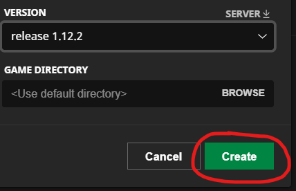
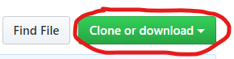

# What you'll need
1. Windows 10 or macOS Mojave (or latest version)
2. Minecraft Java Edition Version 1.12.2
3. Java version 8
4. Python 3
5. Minecraft Forge Client (single-player) Version 1.12.2
6. RaspberryJam Minecraft Mod
7. Node.js
8. Google Chrome web browser (preferred) and an internet connection (for cdn packages)

# Setup Minecraft
1. Install Minecraft on target machine

2. Start the Minecraft Launcher and click **Installations**

    

3. Select **+New** to create a new installation

    

4. Click the version dropdown

    

5. Select version **release 1.12.2** (NAME was left as 'unnamed installation'  but can change as desired)

    

6. Click **Create** to save the new installation

    

7. Select the newly created installation (unnamed installation 1.12.2)

    

8. Click **PLAY** to start a game with the new installation

    

# Setup Forge and Raspberry Jam Mod
1. Install Java version 8

2. Install Python 3

3. Download Minecraft Forge version 1.12.2 at: https://files.minecraftforge.net/

    * **Windows Install:**

        1. Download **Windows Installer** version 1.12.2

            

        2. Start the **Windows Installer** and install the forge client version

            

    * **macOS Install:**

        1. Click **Installer** to download the 'forge-1.12.2-14.23.5.2768-installer.jar' file

            

        2. Open the .jar file and install the forge client version

            

4. Start the minecraft launcher and select the newly created installation

    

6. Go to the Raspberry Jam Repository at https://github.com/arpruss/raspberryjammod and click 'Clone or download'

    

7. Click 'Download ZIP'

    

    * **Windows Install:**

        1. Extract the contents of the raspberry jam mod zip to c:\Users\YOUR USERNAME\AppData\Roaming\minecraft 

            

        2. There will now be a mods.zip file in the .minecraft folder. Extract the contents of this in to the .minecraft\ folder 

    * **macOS Install:**

        1. Locate 'raspberryjammod-master.zip' in the downloads folder
        2. Double-click the .zip file. This will extract the files to 'raspberryjammod-master' folder that is still in **Downloads**
        4. Open the 'raspberryjammod-master' folder and Double-click the mods.zip to extract the files into 'mods' folder which **stays** in the 'raspberryjammod-master' folder
        3. Now run the following commands in the Bash terminal

            ```
            mv /Users/YOUR USERNAME/Downloads/raspberryjammod-master /Users/YOUR USERNAME/Library/Application\ Support/minecraft   

            cd /Users/YOUR USERNAME/Library/Application\ Support/minecraft

            ls
            ```
        4. You should see the 'raspberryjammod-master' inside this folder. We want the contenets of this folder inside the minecraft/ folder and then we can delete 'raspberryjammod-master'. Run these commands:

            ```
            cp -a /Users/YOUR USERNAME/Library/Application\ Support/minecraft/raspberryjammod-master /Users/YOUR USERNAME/Library/Application\ Support/minecraft

            rm /Users/YOUR USERNAME/Library/Application\ Support/minecraft/raspberryjammod-master

            cd /Users/YOUR USERNAME/Library/Application\ Support/minecraft

            ls
            ```
        5. Now all the files that were in the 'raspberryjammod-master' are in the minecraft folder and 'raspberryjammod-master' folder is now deleted


10. Using the Minecraft Launcher, launch the 1.12.2 Forge version of minecraft. 

# Start Pycraft
First, install node.js on your system. You can download it at: https://nodejs.org/en/

To verify node is properly installed open up a terminal and type:
```
node -v 
```
You should see a version number displayed in the terminal.

Run ```npm install``` from the folder which holds the Pycrafty code.
This will install any dependencies for the server on the machine.

Next, start a server for Pycrafty by running the command
```
node bin\www
```
in the project root directory.

Then to launch the Pycrafty application go to the address localhost:3000 in a web browser.
You should now see the full work environment.

# Create a script:
Enter the desired file name in the text box with the text "File name" and click 
the Create Script button. It is recommended to use just alphanumeric characters for the file name.
The file should be saved in the appropriate directory.
If no file name is entered in that text box a file named "script.py" is created
instead. 

# Creating and executing a generated script in Minecraft
Assuming a script was created with the file name "file.py"
open up a minecraft chat window and type: 
```
/lpy file.py
```
to run the script in Minecraft.

# Libraries Used
    * Blockly: https://developers.google.com/blockly/
    * node.js: https://nodejs.org/en/
    * express-generator: https://expressjs.com/en/starter/generator.html
    * notify.js
    * JQuery
    * popper.js
    * bootstrap.js
    * picnic CSS: https://picnicss.com/
    
